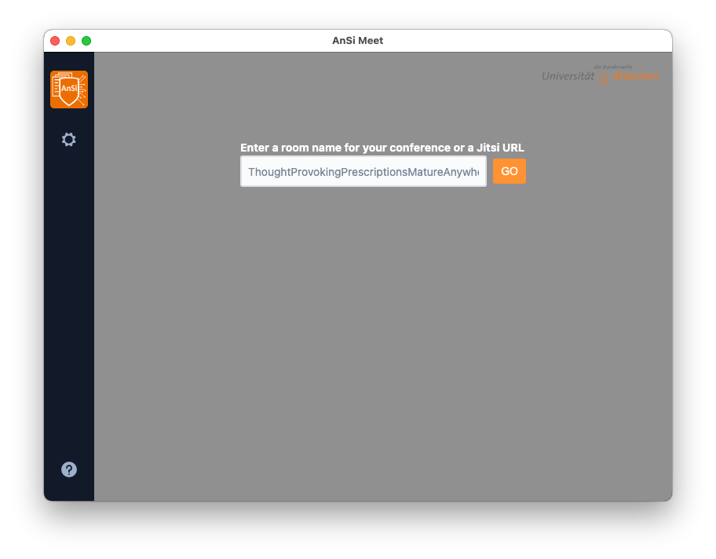

# DatCom Meet Electron

Desktop application for [Jitsi Meet] built with [Electron].

This is a branded version of the *Jitsi Meet Electron* software by the *Privacy and Compliance* group at *Universität der Bundeswehr München*.  
https://github.com/datcom-unibw/jitsi-meet-electron

If you are not looking for this specific version, you are probably looking for the original software, available here:  
https://github.com/jitsi/jitsi-meet-electron

## Branding

- Change the default server to https://meet.datcom-unibw.de (Server requires login)
- Change the color scheme
- Change program identifier strings and URLs to avoid interference with the original application

## Quick Install

### Windows

[Download](https://github.com/datcom-unibw/jitsi-meet-electron/releases/latest/download/datcom-meet.exe) and run "datcom-meet.exe".

The installer is signed by *Universität der Bundeswehr München*.

### macOS

[Download](https://github.com/datcom-unibw/jitsi-meet-electron/releases/latest/download/datcom-meet.dmg) and install "datcom-meet.dmg".

The Apple Disk Image is not signed. Running the application must be enabled in the *macOS* privacy settings.

### Linux

[Download](https://github.com/datcom-unibw/jitsi-meet-electron/releases/latest/download/datcom-meet-x86_64.AppImage) and run "datcom-meet-x86_64.AppImage",

or [download](https://github.com/datcom-unibw/jitsi-meet-electron/releases/latest/download/datcom-meet-amd64.deb) and install the Debian package "datcom-meet-amd64.deb".

The additional command line parameter "--no-sandbox" can be necessary in some cases.



## Features

- [End-to-End Encryption](https://jitsi.org/blog/e2ee/) support (BETA)
- Works with any Jitsi Meet deployment
- Builtin auto-updates
- ~Remote control~ (currently [disabled](https://github.com/jitsi/jitsi-meet-electron/issues/483) due to [security issues](https://github.com/jitsi/security-advisories/blob/master/advisories/JSA-2020-0001.md))
- Always-On-Top window
- Support for deeplinks such as `jitsi-meet://myroom` (will open `myroom` on the configured Jitsi instance) or `jitsi-meet://jitsi.mycompany.com/myroom` (will open `myroom` on the Jitsi instance running on `jitsi.mycompany.com`)

## Installation

Download our latest release and you're off to the races!

### Using it with your own Jitsi Meet installation

:warning: The following additional HTTP headers are known to break the Electron App:

```
Content-Security-Policy "frame-ancestors [looks like any value is bad]";
X-Frame-Options "DENY";
X-Frame-Options "sameorigin";
```
A working Content Security Policy looks like that:
```
Content-Security-Policy "img-src 'self' 'unsafe-inline' data:; script-src 'self' 'unsafe-inline' 'wasm-eval'; style-src 'self' 'unsafe-inline'; font-src 'self'; object-src 'none'; base-uri 'self'; form-action 'none';";
```

## Development

If you want to hack on this project, here is how you do it.

<details><summary>Show building instructions</summary>

#### Installing dependencies

Building the application requires *git*, *node-js* and *python* on all platforms.

Building on Windows additionally requires the C++ component of [*Visual Studio*](https://visualstudio.microsoft.com/).
The *Community Edition* is sufficient.

Install Node.js 16 first (or if you use [nvm](https://github.com/nvm-sh/nvm), switch to Node.js 14 by running `nvm use`).

Clone the git repositoy into a local directory:

```bash
git clone https://github.com/datcom-unibw/jitsi-meet-electron.git
```

Change into the newly created directory:

```bash
cd jitsi-meet-electron
```

<details><summary>Extra dependencies for Windows</summary>

```bash
npm install --global --production windows-build-tools
```
</details>

<details><summary>Extra dependencies for GNU/Linux</summary>

X11, PNG, and zlib development packages are necessary. On Debian-like systems, they can be installed as follows:

```bash
sudo apt install libx11-dev zlib1g-dev libpng-dev libxtst-dev
```
</details>

Install all required packages:

```bash
npm install
```

#### Starting in development mode

```bash
npm start
```

The debugger tools are available when running in dev mode, and can be activated with keyboard shortcuts as [defined here](https://github.com/sindresorhus/electron-debug#features).

They can also be displayed automatically with the application `--show-dev-tools` command line flag, or with the `SHOW_DEV_TOOLS` environment variable as shown:

```bash
SHOW_DEV_TOOLS=true npm start
```

#### Building the production distribution

Full command line for building the production distribution from scratch:

```bash
npm run clean && npm install && npm run dist
```

#### Working with `jitsi-meet-electron-sdk`

[`jitsi-meet-electron-sdk`] is a helper package which implements many features
such as remote control and the always-on-top window. If new features are to be
added or tested, running with a local version of these utils is very handy.

By default, the @jitsi/electron-sdk is build from `npm`. The default dependency path in `package.json` is:

```json
"@jitsi/electron-sdk": "^3.0.0"
```

To work with a local copy, you must change the path to:

```json
"@jitsi/electron-sdk": "file:///Users/name/jitsi-meet-electron-sdk-copy",
```

To build the project, you must force it to take the sources, as `npm update` will
not do it.

```bash
npm install @jitsi/electron-sdk --force
```

NOTE: Also check the [`jitsi-meet-electron-sdk` `README`] to see how to configure
your environment.

#### Publishing

1. Create release branch: `git checkout -b release-1-2-3`, replacing `1-2-3` with the desired release version
2. Increment the version: `npm version patch`, replacing `patch` with `minor` or `major` as required
3. Push release branch to github: `git push -u origin release-1-2-3`
4. Create PR: `gh pr create`
5. Once PR is reviewed and ready to merge, create draft Github release: `gh release create v1.2.3 --draft --title 1.2.3`, replacing `v1.2.3` and `1.2.3` with the desired release version
6. Merge PR
7. Github action will build binaries and attach to the draft release
8. Test binaries from draft release
9. If all tests are fine, publish draft release

</details>

## Known issues

### Windows

None.

### macOS

On macOS Catalina, a warning will be displayed on first install. The app won't open unless "open" is pressed. This dialog is only shown once.

### GNU/Linux

* If you can't execute the file directly after downloading it, try running `chmod u+x ./jitsi-meet-x86_64.AppImage`

* On Ubuntu 22.04, the AppImage will fail with a fuse error (as the AppImage uses `libfuse2`, while 22.04 comes with `libfuse3` by default):

  ```
  dlopen(): error loading libfuse.so.2
  ```

  To fix this, install libfuse2 as follows:

  ```
  sudo apt install libfuse2
  ```


* Under wayland, experimental native wayland support can be enabled with the command-line switch `--ozone-platform-hint` set to `auto`:

  ```
  ./jitsi-meet-x86_64.AppImage --ozone-platform-hint=auto
  ```

  Note that screen-sharing is not currently supported under wayland, and the permissions prompt may loop endlessly.

* If you experience a blank page after jitsi server upgrades, try removing the local cache files:

  ```
  rm -rf ~/.config/Jitsi\ Meet/
  ```

<details><summary>NOTE for old GNU/Linux distributions</summary>

You might get the following error:

```
FATAL:nss_util.cc(632)] NSS_VersionCheck("3.26") failed. NSS >= 3.26 is required.
Please upgrade to the latest NSS, and if you still get this error, contact your
distribution maintainer.
```

If you do, please install NSS (example for Debian or Ubuntu):

```bash
sudo apt-get install libnss3
```

</details>

## Translations

The JSON files are for all the strings inside the application, and can be translated [here](/app/i18n/lang).

New translations require the addition of a line in [index.js](/app/i18n/index.js).

`Localize desktop file on linux` requires the addition of a line in [package.json](/package.json).
Please search for `Comment[hu]` as an example to help add your translation of the English string `Jitsi Meet Desktop App` for your language.

## License

Apache 2. See the [LICENSE] file.

## Community

Jitsi is built by a large community of developers. If you want to participate,
please join the [community forum].

[Jitsi Meet]: https://github.com/jitsi/jitsi-meet
[Electron]: https://electronjs.org/
[latest release]: https://github.com/datcom-unibw/jitsi-meet-electron/releases/latest
[jitsi-meet-electron-sdk]: https://github.com/jitsi/jitsi-meet-electron-sdk
[jitsi-meet-electron-sdk README]: https://github.com/jitsi/jitsi-meet-electron-sdk/blob/master/README.md
[community forum]: https://community.jitsi.org/
[LICENSE]: LICENSE
